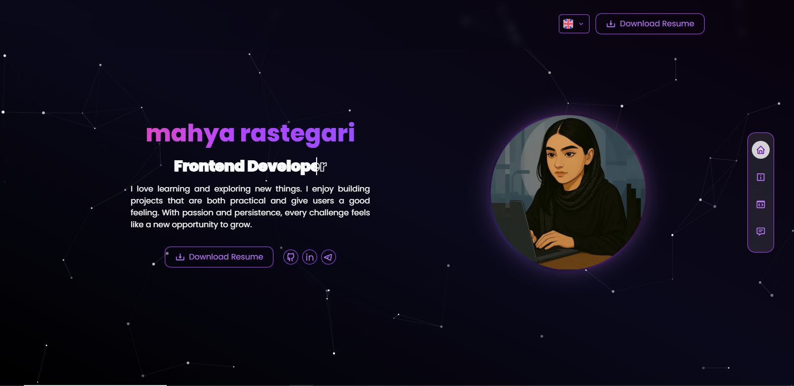
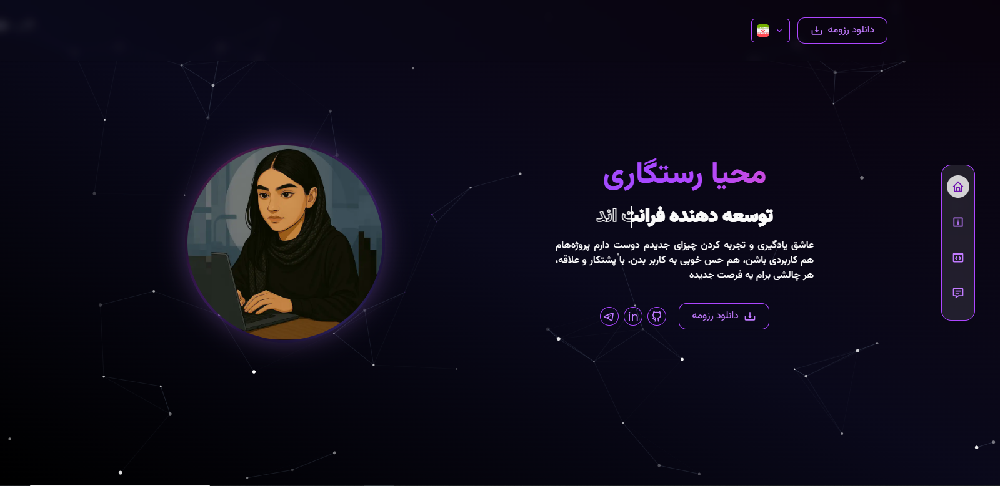
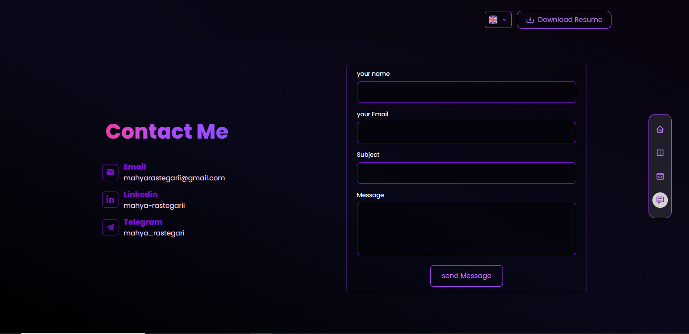
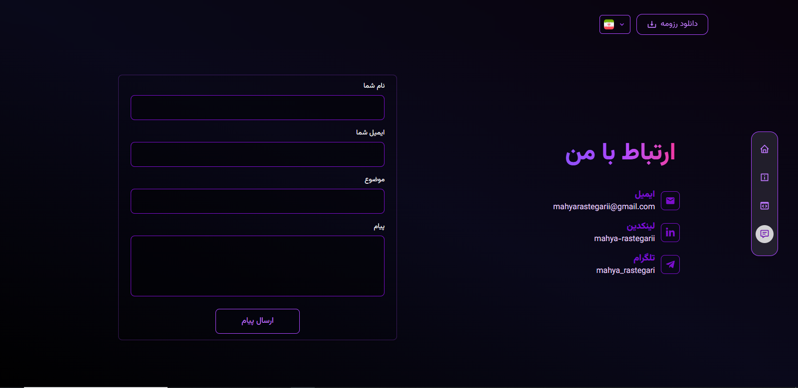
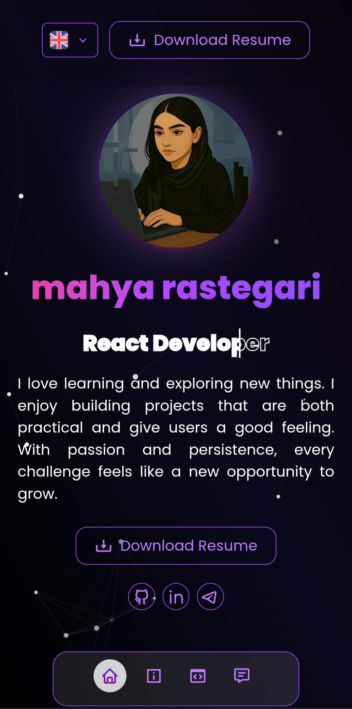

## 👩‍💻 Personal Portfolio | رزومه شخصی آنلاین

## 📝 Description | توضیحات
A modern, responsive, and multilingual personal portfolio built with Next.js and TypeScript.

This project includes:
- 🌐 English & Persian support (Multilingual)
- 📱 Responsive design for all screen sizes
- ✨ Beautiful animations and particle effects
- 📄 Resume download
- 📧 email sending via contact form

---

یک رزومه شخصی مدرن، ریسپانسیو و چندزبانه با استفاده از Next.js و TypeScript طراحی شده است.

ویژگی‌های کلیدی:
- 🌐 پشتیبانی از زبان انگلیسی و فارسی
- 📱 طراحی ریسپانسیو برای تمامی صفحه‌نمایش‌ها
- ✨ انیمیشن‌های زیبا و جلوه‌های ذره‌ای (Particles)
- 📄 امکان دانلود رزومه
- 📧 امکان ارسال ایمیل از طریق فرم تماس
## 📸 Screenshots
### 🖥️ Desktop Version | نسخه دسکتاپ
#### Home Page  

  
  

### Contact Me  

  
  

---

### 📱 Mobile Version | نسخه موبایل
#### Home Page  

  
  

## 🔗 Live Demo | نسخه آنلاین  
👉 [portfolio-website-nu-three-50.vercel.app](https://portfolio-website-nu-three-50.vercel.app/en)

## 🚀 Tech Stack | تکنولوژی‌ها
- Next.js  
- TypeScript  
- Tailwind CSS  
- next-international  
- Framer Motion  
- tsparticles  
- EmailJS  
- React Hook Form  
- React Hot Toast  
- React Icons  

## ⚙️ Features | امکانات
- ✅ Multilingual (English / Persian)  
- ✅ Responsive design    
- ✅ Smooth animations & interactive particles  
- ✅ Resume download option  
- ✅ Contact form with real email sending  
- ✅ Minimal and professional UI

---

- ✅ دوزبانه (انگلیسی و فارسی)  
- ✅ طراحی ریسپانسیو  
- ✅ انیمیشن‌های نرم و پارتیکل‌های تعاملی  
- ✅ قابلیت دانلود رزومه  
- ✅ فرم تماس با امکان ارسال ایمیل واقعی  
- ✅ رابط کاربری مینیمال و حرفه‌ای  

## 🎯 What I Learned | نکاتی که یاد گرفتم  

* Building a minimal and responsive UI using Tailwind CSS and smooth animations with Framer Motion  
* Implementing particle effects with tsparticles and managing forms using React Hook Form  
* Adding multilingual support with next-international  
* Sending emails via EmailJS in a Next.js environment
---

* طراحی رابط کاربری مینیمال با Tailwind و انیمیشن‌های روان با Framer Motion  
* پیاده‌سازی پارتیکل‌ها با tsparticles و مدیریت فرم‌ها با React Hook Form  
* دوزبانه کردن پروژه با next-international  
* ارسال ایمیل با EmailJS در Next.js  

## 🙋‍♀️ Contact Me | ارتباط با من  
📧 [Email](mahya.rastegari@gmail.com)  
💼 [LinkedIn](https://www.linkedin.com/in/mahya-rastegarii)

  
  
  
  
  

